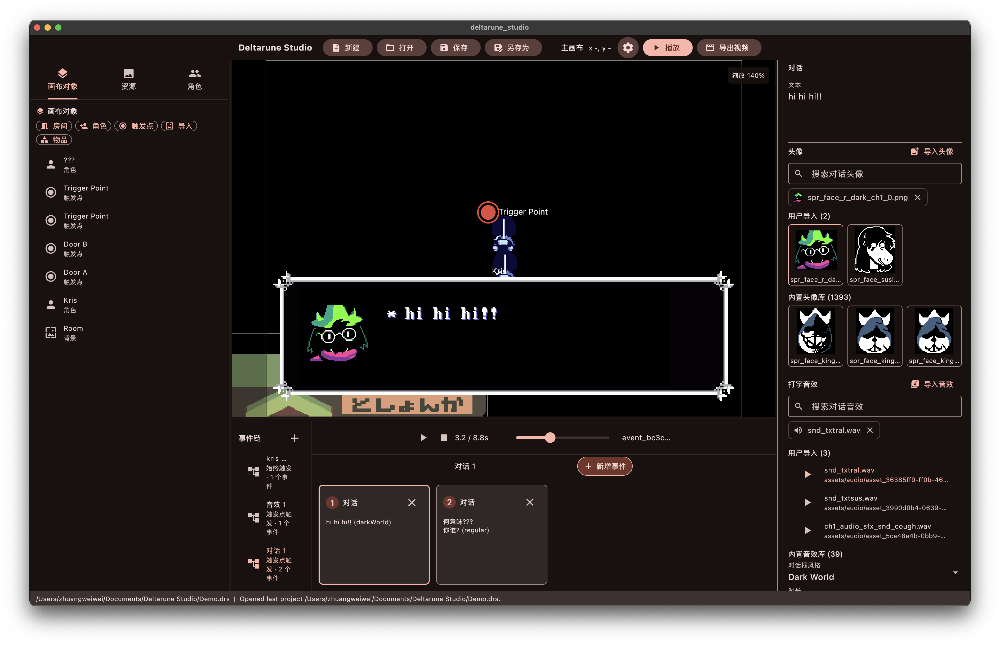

# DeltaruneStudio

只是一个用于制作 deltarune/undertale 风格动画的小工具

## 功能

- 无限画布
- 支持 macOS, Windows, Linux, web
- 画布对象:
    - 房间: 背景图片
    - 角色: 可移动的角色
    - 触发点: 角色的移动路径可与触发点链接, 触发点可触发事件链
    - 物品: 画布中的不可动物品
- 事件链
    - 事件链可由触发点/角色触发
    - 事件链可包含:
        - 角色移动: 定义角色移动路径, 速度, 抖动
        - 等待: 定义角色在停止后的等待时间
        - 切换表情: 可切换成当前角色已定义的表情
        - 对话: 可定义对话内容, 角色图片, 对话框样式
        - 淡出: 相当于门触发器的效果
        - 镜头跟随: 默认开启
        - 镜头聚焦: 可定义时长, 位置
        - 播放音效: 可定义音效资源
        - 播放 bgm: 可定义资源, 默认循环播放, 直到下一个 播放 bgm 触发器

## 截图



## 开发

安装依赖:
```bash
flutter pub get
```

运行:
```bash
flutter run -d <platform>
```

构建:
```bash
flutter build <platform>
```

`dev` 分支为主要开发分支
`main` 分支为稳定分支，仅用于发布稳定版本

## [许可证](LICENSE)

本项目采用 GPL 3.0 许可证, 本项目中的部分资源来自 deltarune 原作，不属于本许可证范围，如侵删
